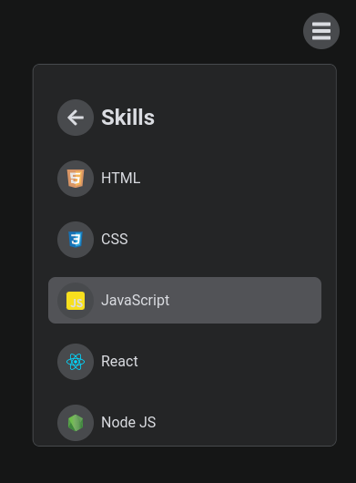

## Menu Desplegable (Dropdown Menu)

> **Importante:** Las dependencias actuales se encuentran en las siguientes versiones:

- **react**: ^18.0.0
- **react-dom**: ^18.0.0
- **react-transition-group**: 4.3.0

## Idea General

Crear un menu desplegable ocupando react. Este tiene un menu principal y submenus. Ocupe imagenes SVG para los iconos.

#### Tecnologías ocupadas

- [ ] React
- [ ] NodeJS
- [ ] JavaScript
- [ ] HTML
- [ ] CSS




### _Si encuentras algun bug, o algo en lo que pueda mejorar, te agradeceria el comentario._

> **Importante:** Si clonas o descargas este repositorio ten en cuenta lo siguiente:

```
*Instala los paquetes:
npm install

*Ejecuta la aplicación
npm start
```
