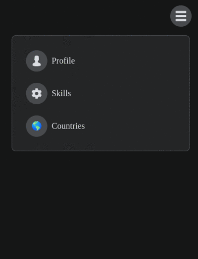

[🇲🇽-Español](../README.md)

<h1 align="center">Dropdown menu</h1>

<p align="center">
   
    
</p>


## Description 📋

Dropdown menu with react. Clicking opens the main menu that contains submenus. Use SVG images for the icons.

**Steps to run the project on your computer 🔧**

```txt
  1. Fork the repository
  2. Clone the repository to your local
  3. Install the dependencies with: npm install
  4. Run: npm start
```

> **_Important:_** Dependencies are in the following versions:

- **react**: 18.2.0
- **react-dom**: 18.2.0
- **react-transition-group**: 4.3.0

## Technologies 🖥

- React
- JavaScript
- HTML
- CSS

## Author

| [<br><sub>Emmanuel Arenas</sub>](https://github.com/EmmanuelArenas) |
| :--------------------------------------------------------------------------------------------------------------------------------------------------------------------------------------------: |

## License 📄

License: [MIT](License)

## Preview


